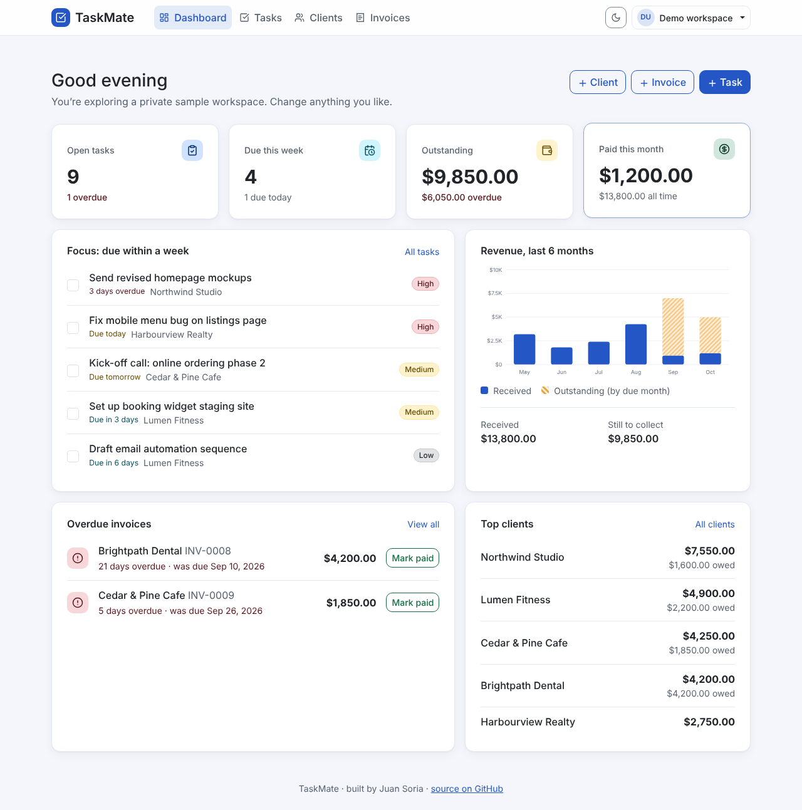
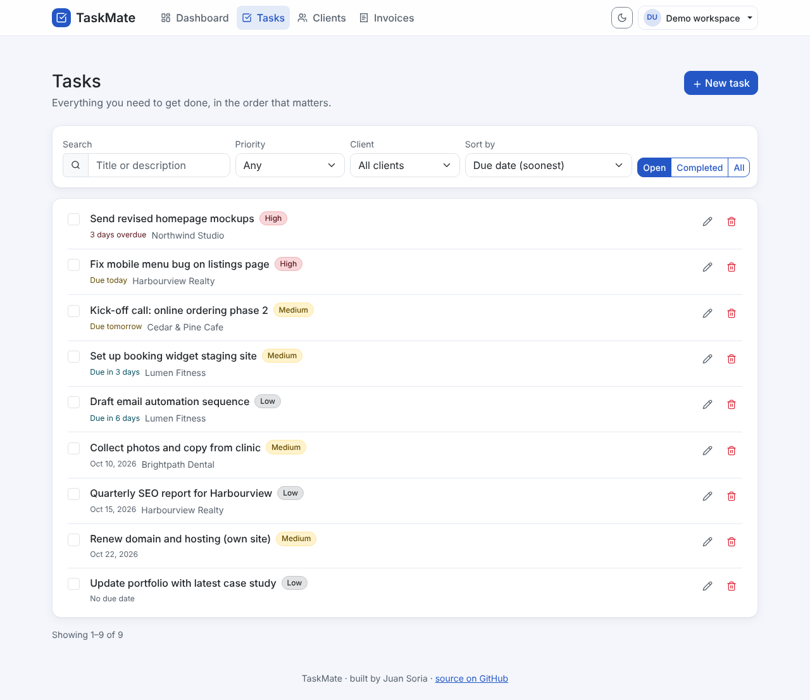
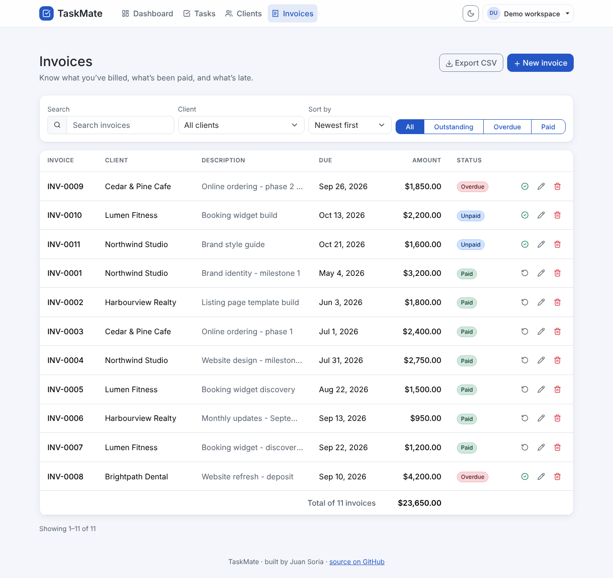
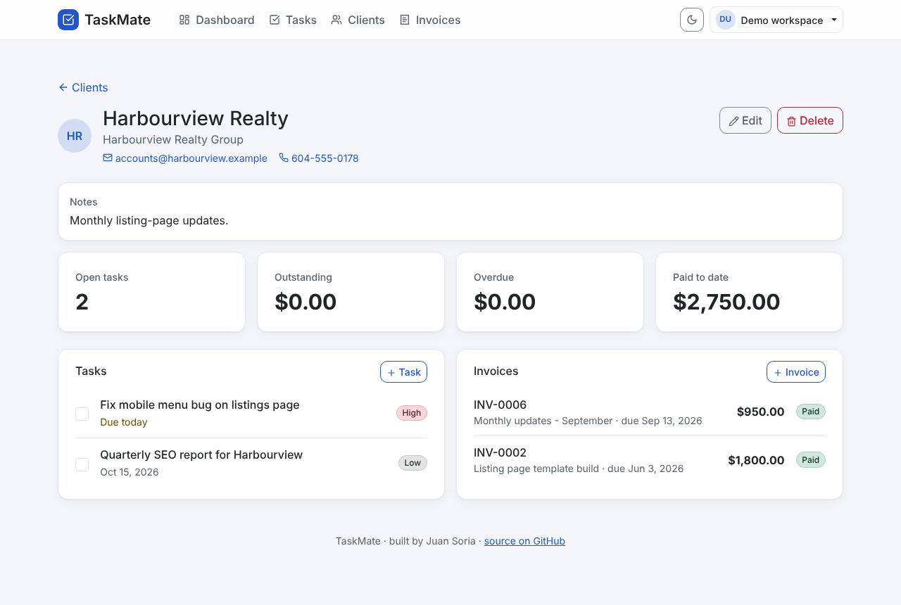
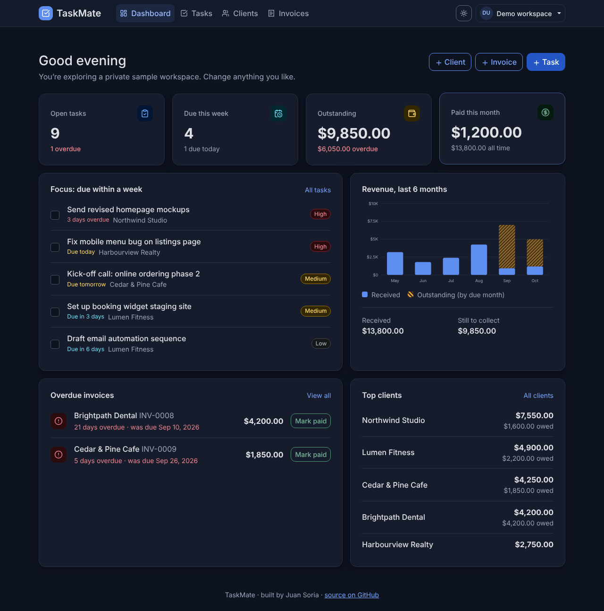
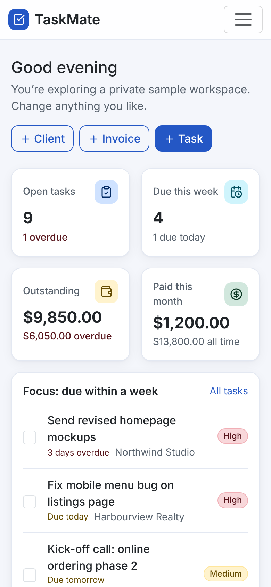
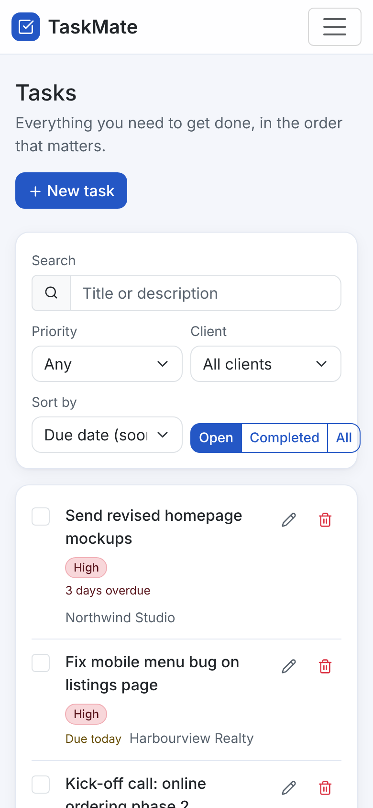
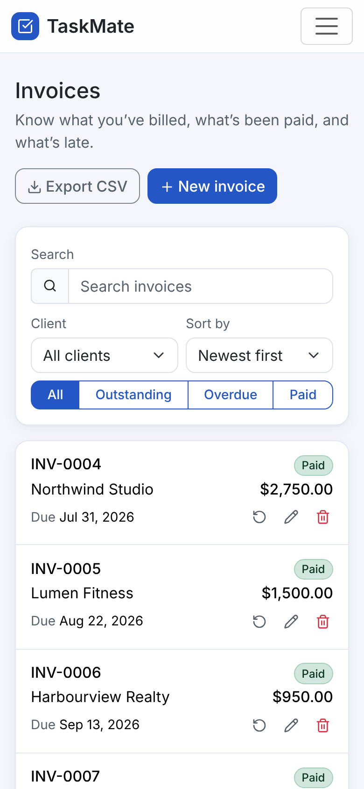

# TaskMate

**A client, task and invoice workspace for freelancers.** Keep track of what needs doing, who it's for, what you've billed and what's still unpaid, all in one fast, accessible app.

Built end to end by **Juan Soria** with React, Express and MongoDB, and covered by roughly 550 automated tests.

<p align="center">
  
</p>

## Live demo

| | |
|---|---|
| **App** | https://YOUR-SITE.netlify.app |
| **API health check** | https://taskmate-2njo.onrender.com/api/health |

No sign-up needed: press **Explore with sample data** on the sign-in page and you get a private sample workspace (clients, tasks and invoices, some of them overdue) that you can change freely. Each demo workspace deletes itself after 24 hours.

> The API runs on Render's free tier, which sleeps when idle. The first request after a quiet period can take up to a minute, so the app shows a "waking the server up" banner instead of an error and retries on its own.

## What it does

- **Dashboard.** Open and overdue tasks, what is due this week, outstanding and overdue money, what was paid this month, a six month revenue chart, your top clients, and one-click "mark paid" / "complete" actions right where you see the problem.
- **Tasks.** Priorities, due dates, client links, search, filters (status, priority, client), sorting and paging. Every filter lives in the URL, so a refresh, a bookmark or a link from the dashboard lands on the same view.
- **Clients.** Contact details, notes, and a client page that shows their tasks, invoices and what they owe you. A client who still has invoices cannot be deleted by accident: you have to confirm that the invoices go too. Their tasks are kept and simply unlinked.
- **Invoices.** Automatic sequential numbering (`INV-0001`, `INV-0002`, ...), paid / unpaid / overdue status that is worked out from the due date, filters, search, per-invoice detail page and totals for whatever you are looking at.
- **CSV export** for tasks, clients and invoices, safe to open in Excel or Sheets.
- **Accounts.** Sign up, sign in, or delete your account and every record in it from the account menu.
- **Light and dark themes** that follow your system setting and can be switched by hand.
- **Works on a phone.** The invoice table turns into stacked cards on small screens; nothing scrolls sideways.

<table>
  <tr>
    <td width="50%"></td>
    <td width="50%"></td>
  </tr>
  <tr>
    <td align="center"><sub>Tasks: search, filter, sort, complete in place</sub></td>
    <td align="center"><sub>Invoices: status filters and running totals</sub></td>
  </tr>
  <tr>
    <td width="50%"></td>
    <td width="50%"></td>
  </tr>
  <tr>
    <td align="center"><sub>A client's open work and balance</sub></td>
    <td align="center"><sub>Dark mode</sub></td>
  </tr>
</table>

<p align="center">
  
  &nbsp;
  
  &nbsp;
  
</p>

## Tech stack

| Layer | Tools |
|---|---|
| Frontend | React 18, Vite 6, React Router 7, React-Bootstrap / Bootstrap 5.3, Axios, Lucide icons |
| Backend | Node.js, Express 4, Mongoose 8, Zod (validation), JSON Web Tokens, bcryptjs, Helmet, express-rate-limit |
| Database | MongoDB (Atlas in production) |
| Testing | Jest + Supertest + an in-memory MongoDB (API), Vitest + Testing Library + MSW (UI), Playwright + axe-core (end to end) |
| Delivery | GitHub Actions (CI), Render (API), Netlify (frontend) |

## Engineering highlights

The original project was a working CRUD app. This version keeps its stack and API contract and focuses on the things that separate a demo from software you would trust with real data.

**Dates behave like calendar dates, not timestamps.** A due date of "June 5" is stored as midnight UTC and displayed in UTC, so it is June 5 for everybody, in every time zone, all year. The browser tells the API what "today" is for the user (`X-Client-Today`), so "overdue" and "due today" are correct even when the server is on a different day than the person using the app.

**Invoice status is derived, not trusted.** The database stores `paid` or `unpaid`; the API computes the effective status (`overdue` once the due date has passed) on the way out, and the `overdue` / `outstanding` filters, dashboard totals and CSV export all use the same rule. Nothing needs a nightly job to flip a flag.

**Invoice numbers are atomic.** Each user has a counter document incremented with a single atomic operation, with a retry on the rare duplicate-key collision. A test fires concurrent creates and checks that every number is unique.

**Search that cannot show stale results.** A small `useAsync` hook discards any response that is not from the latest request, so typing quickly never lets a slow old response overwrite a newer one. Search input is debounced and kept in the URL.

**Validated and hardened API.** Every route validates its body, query and params with Zod schemas that strip unknown fields (no mass assignment) and reject non-string operators (no NoSQL injection such as `{"$ne": null}` for an email). User search text is regex-escaped. Passwords are hashed with bcrypt and login does constant-time work even for unknown emails. Helmet headers, request size limits, and separate rate limits for the general API, sign-in and demo creation. CSV export neutralises spreadsheet formulas (`=`, `+`, `-`, `@`) in user text.

**Consistent errors.** Every failure is `{ "msg": "...", "errors": { "field": "..." } }`. The frontend maps field errors onto the form fields and shows a retry state for network failures instead of an empty page.

**Resilient to a sleeping server.** A status banner polls `/api/health` every few seconds while Render wakes up, requests allow up to 45 seconds before giving up, and an expired or revoked session (a 401 on any request) signs you out cleanly instead of leaving a broken screen.

**Accessible by default.** Semantic landmarks, labelled controls and dialogs, focus management, live-region toasts (`status` for success, `alert` for errors), keyboard-operable everything, visible focus, reduced-motion support, and a colour palette tuned to WCAG AA contrast. The Playwright suite runs axe-core on every main screen in both themes and fails on any violation.

**Demo mode.** `POST /api/auth/demo` seeds a realistic workspace relative to today's date (so there is always something due and something overdue) and attaches a TTL index so MongoDB removes it automatically.

### What changed from the first version

Concrete problems that were found and fixed, rather than cosmetic changes:

- Due dates shifted by a day for anyone west of UTC because dates were parsed and rendered in local time.
- Fast typing in the search box could display results for an older query.
- Deleting a task, client or invoice happened immediately with no confirmation.
- Finding one invoice meant downloading the whole list and filtering in the browser; lists are now paginated and filtered on the server, with totals.
- Request bodies were passed straight to Mongoose (mass assignment), query values could be objects (NoSQL injection), and search strings were used as raw regular expressions.
- There was little input validation and no consistent error format.
- Overdue was only a stored label that could drift from reality: an invoice stayed "unpaid" after its due date passed.
- Test coverage was thin (a handful of basic tests), there was no CI, and no way to try the app without registering.

## Project structure

```
TaskMate/
├── backend/              Express API
│   ├── app.js            App factory (middleware, routes) used by the server and the tests
│   ├── server.js         Entry point: connects to MongoDB, starts listening
│   ├── config/           Environment parsing and validation
│   ├── middleware/       Auth, validation, rate limits, error handling
│   ├── models/           Mongoose models: User, Client, Task, Invoice, Counter
│   ├── schemas/          Zod request schemas
│   ├── routes/           auth, clients, tasks, invoices, dashboard, exports, health
│   ├── services/         Dashboard maths, demo workspace seeding
│   ├── utils/            Dates, CSV, pagination, serializers, regex escaping
│   └── tests/            Unit and integration tests
├── frontend/             React single page app
│   └── src/
│       ├── pages/        Route-level screens
│       ├── components/   Layout, modals, badges, chart, pager, feedback states
│       ├── context/      Auth, theme and toast providers
│       ├── hooks/        useAsync, useDebounced
│       ├── services/     Axios client and typed endpoint helpers
│       ├── utils/        Formatting, error mapping, safe storage
│       └── test/         MSW-based fake API and render helpers
├── e2e/                  Playwright end-to-end suite (also generates the screenshots)
├── docs/screenshots/     Images used in this README
├── .github/workflows/    CI pipeline
├── render.yaml           Render blueprint for the API
└── frontend/netlify.toml Netlify build, redirects and security headers
```

## Getting started

You need **Node.js 20 or newer** (22 recommended) and a MongoDB database (a free [MongoDB Atlas](https://www.mongodb.com/atlas) cluster works, or a local `mongod`).

```bash
git clone https://github.com/jcsv1991/TaskMate.git
cd TaskMate
npm run install:all
```

Create `backend/.env` from the example and fill in at least `MONGO_URI` and `JWT_SECRET`:

```bash
cp backend/.env.example backend/.env
```

Then start the API (port 5000) and the web app (port 5173) together:

```bash
npm run dev
```

Open http://localhost:5173. In development the Vite server proxies `/api` to the API, so there is nothing else to configure. Click **Explore with sample data**, or register an account.

### Environment variables

**API (`backend/.env`)**

| Variable | Required | Default | Purpose |
|---|---|---|---|
| `MONGO_URI` | yes | | MongoDB connection string |
| `JWT_SECRET` | yes | | Secret used to sign tokens. Use a long random value |
| `PORT` | no | `5000` | Port to listen on |
| `CORS_ORIGIN` | recommended | any origin | Comma separated list of allowed browser origins, e.g. your Netlify URL |
| `JWT_EXPIRES_IN` | no | `1d` | Token lifetime |
| `DEMO_ENABLED` | no | `true` | Turns the one-click demo workspace on or off |
| `DEMO_TTL_HOURS` | no | `24` | How long a demo workspace lives |
| `RATE_LIMIT_ENABLED` | no | `true` | Turns rate limiting on or off |
| `RATE_LIMIT_MAX` | no | `600` | Requests per 15 minutes per IP (general API) |
| `RATE_LIMIT_AUTH_MAX` | no | `30` | Requests per 15 minutes per IP for sign-in and sign-up |
| `RATE_LIMIT_DEMO_MAX` | no | `10` | Demo workspaces per hour per IP |

**Web app (`frontend/.env.local`, all optional)**

| Variable | Default | Purpose |
|---|---|---|
| `VITE_API_URL` | hosted API | API base URL baked into a production build |
| `VITE_PROXY_TARGET` | `http://localhost:5000` | Where the dev server proxies `/api` |
| `VITE_CURRENCY` | `USD` | ISO 4217 currency code used to format money |

### Useful scripts

| Command | What it does |
|---|---|
| `npm run dev` | API and web app with hot reload |
| `npm run build` | Production build of the web app |
| `npm start` | Start the API |
| `npm run lint` | ESLint for both packages |
| `npm test` | API tests, then UI tests |
| `npm run test:e2e` | Browser tests (see below) |

## Testing

| Suite | Tool | Tests | Notes |
|---|---|---|---|
| API unit and integration | Jest, Supertest, mongodb-memory-server | 248 | About 98% line coverage. Runs against a real in-memory MongoDB, not mocks |
| Frontend components and pages | Vitest, Testing Library, MSW | 256 | About 97% line coverage. A stateful fake API implements the real contract, including error cases |
| End to end | Playwright, axe-core | 44 | Real browser against a real API and database |

```bash
npm test                                   # API + UI
cd backend  && npm run test:coverage       # API with coverage report
cd frontend && npm run test:coverage       # UI with coverage report

# End to end: starts the API and a production build of the web app for you
cd e2e && npm install && npx playwright install chromium
npm test                                   # set E2E_MONGO_URI to use your own MongoDB
```

What the tests cover beyond the happy path:

- **Correctness of money and dates**: overdue boundaries (due today is not overdue, due yesterday is), time zones far from UTC, calendar-date round trips, leap days, totals across pages, unique invoice numbers under concurrent requests.
- **Security**: users cannot read, edit or delete each other's data; mass assignment, NoSQL operator and regex injection attempts; expired and tampered tokens; CSV formula injection; HTML in user text rendered as text.
- **Failure handling**: failing networks, 401 mid-session, server errors, empty states and stale-response ordering.
- **Accessibility**: axe-core scans of every main screen in light and dark themes, keyboard-only flows, labelled dialogs and live-region announcements.
- **Responsive layout**: no horizontal overflow at phone and tablet widths on any page.
- **Mutation spot checks**: fourteen key rules (overdue boundary, status derivation, pagination maths, ownership filters and so on) were deliberately broken by hand to confirm the tests fail. Twelve were caught (one initially survived and led to an extra test case); the other two did not change observable behaviour.

## API reference

Base path `/api`. Authenticate with `x-auth-token: <jwt>` or `Authorization: Bearer <jwt>`. Send the browser's local date as `X-Client-Today: YYYY-MM-DD` so overdue maths matches the user's day (optional; it is only honoured within two days of the server's date, otherwise the server's UTC date is used).

| Method | Path | Description |
|---|---|---|
| GET | `/health` | Liveness and database status |
| POST | `/auth/signup` | Create an account. Returns `{ msg, token, user }` |
| POST | `/auth/login` | Sign in. Returns `{ token, user }` |
| POST | `/auth/demo` | Create a sample workspace that expires automatically |
| GET / PATCH / DELETE | `/auth/me` | Read or rename the current user; delete the account and all its data |
| GET | `/dashboard/summary` | Task, invoice and client statistics, focus list, overdue list, top clients, six month revenue |
| GET | `/tasks` | List. Filters: `completed`, `priority`, `clientId`, `clientName`, `search`, `dueAfter`, `dueBefore`, `overdue`; `sortBy`, `order`, `page`, `limit` |
| POST | `/tasks` | Create |
| GET / PUT / PATCH / DELETE | `/tasks/:id` | Read, update, delete |
| PATCH | `/tasks/:id/completed` | Mark as done |
| GET | `/clients` | List, each with task and invoice stats. Filters: `search`; `sortBy`, `order`, `page`, `limit` |
| POST | `/clients` | Create |
| GET / PUT / PATCH | `/clients/:id` | Read (returns `{ client, tasks, invoices, stats }`) or update |
| DELETE | `/clients/:id` | Delete. Returns `409` if the client has invoices; add `?cascade=true` to delete them too. Tasks are always kept and unlinked |
| GET | `/invoices` | List. Filters: `status` (`paid`, `unpaid`, `overdue`, `outstanding`), `clientId`, `clientName`, `search`; `sortBy`, `order`, `page`, `limit` |
| POST | `/invoices` | Create. The number is assigned automatically |
| GET / PUT / PATCH / DELETE | `/invoices/:id` | Read, update, delete |
| GET | `/export/tasks.csv`, `/export/clients.csv`, `/export/invoices.csv` | CSV download |

Conventions:

- **Pagination.** List endpoints return a plain JSON array and describe the paging in headers: `X-Total-Count`, `X-Page`, `X-Per-Page`, `X-Total-Pages`. Invoice lists also return `X-Total-Amount` (the sum of everything matching the filter, not just the current page).
- **Errors.** `{ "msg": "Human readable summary", "errors": { "field": "What is wrong" } }` with the right status code: `400` validation, `401` missing or bad token, `404` not found (including other people's records), `409` conflict, `429` rate limited.
- **Dates.** Send `YYYY-MM-DD`; impossible dates such as `2025-02-31` are rejected. They are stored as midnight UTC and the UI formats them in UTC, so a due date never shifts.
- **Money.** Positive numbers with up to two decimals, rounded when stored.

## Deployment

The app is a static frontend plus a Node API, deployed separately.

### 1. Database

Create a free MongoDB Atlas cluster, add a database user, and allow network access from Render. Atlas free clusters need `0.0.0.0/0` in Network Access because Render's free tier has no fixed outbound IP.

### 2. API on Render

Either use the included blueprint (**New, Blueprint, pick this repository**; it reads `render.yaml`) or create a Web Service by hand:

| Setting | Value |
|---|---|
| Root directory | `backend` |
| Build command | `npm ci --omit=dev` |
| Start command | `node server.js` |
| Health check path | `/api/health` |

Environment variables: `MONGO_URI`, `JWT_SECRET` (the blueprint generates one), `CORS_ORIGIN` (your Netlify URL), and optionally `DEMO_ENABLED`.

The repository root also has a `package.json` that mirrors the backend's runtime dependencies, so a Render service created with the default root directory (build `npm install`, start `npm start`) works too. A test keeps the two manifests in sync.

### 3. Frontend on Netlify

Import the repository and set:

| Setting | Value |
|---|---|
| Base directory | `frontend` |
| Build command | `npm run build` |
| Publish directory | `dist` |
| Environment variable | `VITE_API_URL` = `https://<your-api>.onrender.com/api` |

`frontend/netlify.toml` already contains these settings, the single page app redirect (so deep links and refreshes work), security headers, and long-lived caching for hashed assets. After the first deploy, copy the site URL into the API's `CORS_ORIGIN`.

### Continuous integration

`.github/workflows/ci.yml` runs on every push to `main` and every pull request: lint and API tests on Node 20 and 22, lint, UI tests and a production build for the frontend, then the Playwright suite against a real MongoDB service. Render and Netlify redeploy automatically from `main`.

## Security notes

- Passwords are hashed with bcrypt; tokens are signed JWTs with a configurable lifetime.
- Every query is scoped to the authenticated user's id; another user's record returns `404`, so ids cannot be probed.
- Input is validated and stripped to known fields on every route; limits on body size and field lengths.
- Regular-expression search input is escaped; CSV cells that start with a formula character are neutralised.
- The token is kept in `localStorage` for simplicity. That is a reasonable trade for a portfolio app, but a production product handling sensitive data would be better served by `httpOnly` cookies with CSRF protection.

## Roadmap

Ideas that fit naturally into what is already here:

- Recurring tasks and invoice reminders by email
- PDF invoices and a payment link per invoice
- Time tracking that rolls up into an invoice
- Attachments on tasks and clients
- Multi-user workspaces with roles

## License

Released under the [MIT License](LICENSE).

---

Designed and built by **Juan Soria**.
